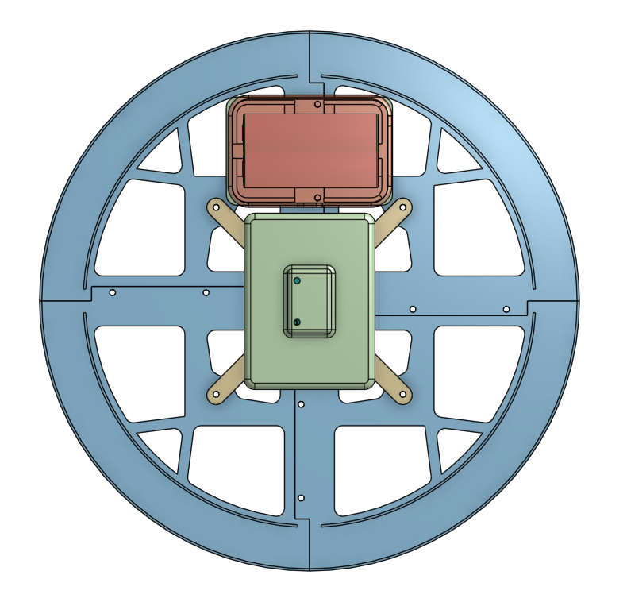
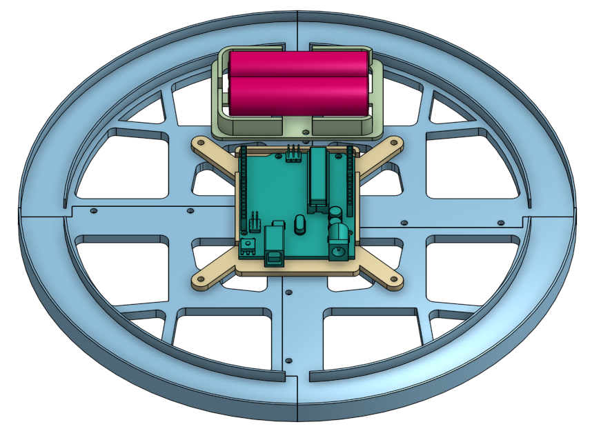

# Magnet_ClockGame

Este proyecto consiste en una tira de LEDs dispuesta en un círculo que puede controlar la iluminación del LED moviendo un imán a su alrededor que capta el valor de campo magnético con un magnetómetro MPU9250.

# Instrucciones de juego

Al inicio comienza una secuencia rápida y aleatoria que no nos permitirá visualizar en dónde se encuentra el último LED que será nuestro objetivo, por lo que deberemos prestar mucha atención.

Una vez finalizada la secuencia tendremos que buscar el LED con el imán hasta dar con su posición exacta.

# Montaje

Lista de materiales

- **Arduino UNO**
- Tira de **LEDs indexados** con una longitud de 40 píxeles
- Sensor **MPU9250**
- Batería
- Botón de encendido
- [Piezas impresas](https://cad.onshape.com/documents/8b325df2fea1fa8e10a6a44f/w/a49b48a4fa16b2ccfe2ab2df/e/95fb1fe75783121f01e89aed?renderMode=0&uiState=61786382cf5ecc4989e6c1ff)
    - 4x Quarter Clock
    - Arduino_Base
    - Battery_Base
    - Battery_Cover
    - Clock_Cover
- 14 x Tornillos M3x10

### Conceptos de aprendizaje

- Funcionamiento de magnetómetro **MPU9250**
- Conversión de medidas magnéticas en ejes X e Y a un **vector 2D** con magnitud y **coordenadas angulares**
- Visualización del ángulo en tira de LEDs en disposición circular
- Programación del modelo de juego
- Integración de aleatoriedad